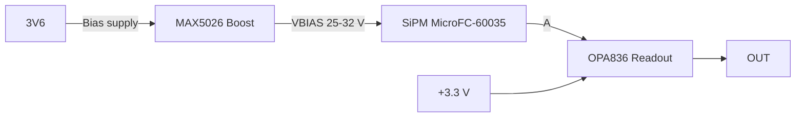

# USTSIPM01 — Silicon photomultiplier (SiPM) interface module  


Complete analog front‑end for Silicon Photomultipliers (SiPM). The module provides resistor-configurable high‑voltage bias for the SiPM sensor and a low‑noise, wideband readout stage suitable for timing and amplitude measurements.

## Features

* Footprint for onsemi **MicroFC‑60035‑SMT** SiPM (6×6 mm, 35 µm microcells).
* On‑board high‑voltage boost converter MAX5026 generating the SiPM bias from the +5 V rail.
* Precision feedback network with design equation Vout = 1.25 V × (1 + R2/R3); default configuration targets to 31.7 V bias.
* Low‑noise **wideband amplifier** stage OPA836 for SiPM signal readout.
* Pin-header connector for lab bring‑up and diagnostics.

## Block Diagram



## Electrical Characteristics (module)

* Supply rails: +3.6 V (bias converter), +3.3 V (analog stage).
* SiPM bias range: designable in \~25–32 V via resistor ratio (see below). Default assembly ≈ 31.7 V.
* Output: single‑ended, wideband path suitable for 50 Ω instrumentation (use external 50 Ω termination at scope/DAQ as required).

> Note (SiPM operating point): The sensor is biased at Vout = VBR + VOV, where VBR is the device’s breakdown voltage and VOV is the selected overvoltage. Typical recommended VOV = 1…5 V. Temperature coefficient of VBR ≈ +21.5 mV/°C (adjust bias accordingly).

## Bias Network Design

The MAX5026 feedback follows:

```
Vout = 1.25 V × (1 + R2/R3)
```

**Default population** (R2 = 3.9 MΩ, R3 = 160 kΩ) yields:

```
Vout ≈ 1.25 × (1 + 3.9M/160k) ≈ 31.7 V
```

**Example design** for MicroFC‑60035 with typical VBR ≈ 24.7 V:

* For **VOV = 3.0 V** → target **Vout ≈ 27.7 V**.
* Choose standard values to satisfy 1.25 × (1 + R2/R3) ≈ 27.7. For example, **R3 = 160 kΩ**, **R2 ≈ 3.394 MΩ** (use 3.40 MΩ or parallel combination). Verify with measurement on the assembled board.

> Keep the feedback resistors in the **MΩ** range to minimize divider current, and place them tight to the FB node. Use a low‑leakage layout around FB.
> Treat the SiPM and the module as **ESD‑sensitive**.

## Operating Guidance

* Start at low overvoltage (e.g., +1…2 V above the measured VBR) and increase gradually while monitoring dark count and pulse shape.
* Observe the maximum average current rating of the chosen sensor (for 6×6 mm devices typically tens of mA). Avoid saturating the device with continuous high optical flux.

## Changeable Parameters

* **SiPM bias (R2/R3):** select to set the required overvoltage window for the specific sensor lot and operating temperature.
* **OPA836 gain (R10/R12):** non‑inverting stage; A\_v = 1 + R10/R12. Default R10 = 12 kΩ, R12 = 1 kΩ → A\_v ≈ 13 V/V (\~22.3 dB). Adjust these resistors to set the desired voltage gain. (See schematic).


